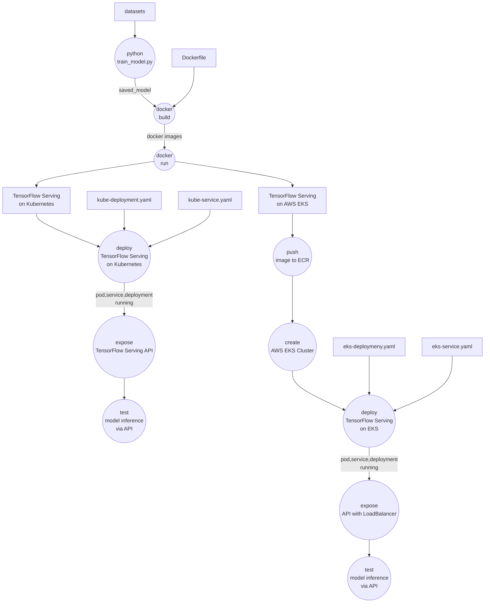

**Machine Learning - Zoomcamp**
# E-Commerce Engagement Prediction Model

---

## Project Overview

This project aims to predict the engagement of tweets related to several e-commerce companies. Engagement is defined as a combination of likes, replies, and retweets. The model processes input text (preprocessed tweets) and hashtag information to output an engagement score that reflects the potential audience interaction.

The project implements TensorFlow Serving, Kubernetes, Docker, and AWS Kubernetes (EKS) for efficient model deployment ⁷and scalability.

---

## Table of Contents

- Project Overview

- Features and Target

- Objective

- Technologies Used

- Dataset

- Tasks Flow

- Model
  
- Repositiry Structures

- Deployment Architecture

- How to Run the Project

- API Usage

- Results

- Future Improvements

- Acknowledgments

---

## Features and Target

### Features
1. clean_tweet: Preprocessed version of the tweet text (lowercased, tokenized, and cleaned).
2. hashtags: Count or presence of hashtags in the tweet

### Target
engagement: A continuous value representing the combination of likes, replies, and retweets.


## Objective

The primary goals of this project are to:

Predict the engagement score for a given tweet based on its content and hashtags.

Deploy the model using TensorFlow Serving for real-time predictions.

Containerize the application using Docker.

Orchestrate the deployment using Kubernetes and scale it on AWS EKS for production-level deployment.

---

## Technologies Used

The project integrates the following technologies:

1. HDFS: Saving data
2. Pyspark: Data processing
3. TensorFlow: For building and saving the deep learning model.
4. Flask: To create an API for serving predictions.
5. Docker: Containerizes the Flask API and TensorFlow model.
6. TensorFlow Serving: Optimized model serving for real-time predictions.
7. Kubernetes: Orchestrates containers for scaling and deployment.
8. AWS EKS: Managed Kubernetes service for deployment in the cloud.

--- 
## Dataset

Dataset header: **Indonesia's Top E-Commerce Tweets**

Dataset link: [https://www.kaggle.com/datasets/robertvici/indonesia-top-ecommerce-unicorn-tweets](https://www.kaggle.com/datasets/robertvici/indonesia-top-ecommerce-unicorn-tweets)

Dataset content: 


**About Dataset**

This dataset contains the tweets from the first tweet until April 2020 of top e-commerce unicorn in Indonesia namely Shopee, Tokopedia, Bukalapak, Lazada and Blibli.

The dataset consists of tweets about an associated engagement metrics. Each data point includes:
- Tweet text
- Number of hashtags
- Engagement value (target)

Preprocessing includes:
- Text cleaning: Removing punctuation, special characters, and links.
- Tokenization: Splitting text into tokens.

---

## Tasks Flow

Model deployment of TensorFlow Serving on Kubernetes and AWS EKS.




## Model

The project uses a deep learning model built using Keras to predict the engagement score. The model is then exported for TensorFlow Serving.

Steps:
1. Train and save the model in TensorFlow SavedModel format.
2. Use TensorFlow Serving to serve the model.
3. Create a Flask API to send input to TensorFlow Serving and return predictions.

---

## Repository Structures

   ```
   ├── README.md                                 # Documentation for the project
   ├── config                                    # Configuration files
   │   ├── kube-deployment.yaml
   │   ├── kube-service.yaml
   │   ├── eks-deployment.yaml
   │   ├── eks-service.yaml
   ├── src                                       # Code (python scripts)
   │   ├── train_model.py
   │   ├── predict_model.py
   │   ├── notebook.ipynb
   │   ├── EDA.ipynb
   ├── build-docker-image.md                     # Build docker and run container commands 
   ├── kubectl-apply.md                          # Kubernetes deployment and service commands
   ├── Dockerfile                                # Instructions to containerize the application
   ├── saved_model                               # Final saved model
   │   ├── assets
   │   ├── fingerprint.pb
   │   ├── saved_model.pb
   │   └── variables
   │       ├── variables.data-00000-of-00001
   │       └── variables.index
   ├── tokenizer.pkl                            # Tokenizer output

   ```

---

## Deployment Architecture

The project follows a microservices deployment architecture:

1. Model Deployment

   The trained Keras model is exported to TensorFlow SavedModel format.

   TensorFlow Serving hosts the model and provides an endpoint for predictions.

2. API Deployment

   A Flask application sends requests to TensorFlow Serving and returns predictions to clients.

   The Flask app is containerized using Docker.

3. Kubernetes Orchestration

   The TensorFlow Serving container is orchestrated using Kubernetes.

   Kubernetes is deployed locally or in AWS EKS for scalability.

4. AWS EKS Deployment

   Use AWS Elastic Kubernetes Service (EKS) for production-level deployment and scaling.

---

## How to Run the Project

### Prerequisites

Ensure you have the following installed:

- Python 3.10+
- Kaggle account and local authorization setup
- AWS account and local authorization & CLI setup
- TensorFlow/Keras
- Docker
- Kubernetes
- kubectl
- kind

### Steps

1. Clone this repository
   ```
   git clone https://github.com/ketut-garjita/E-Commerce-Engagement-ML.git
   ```
   
2. Model Training and Saving

   Run the model training script and save the model in TensorFlow SavedModel format:

   ```
   cd E-Commerce-Engagement-ML
   python src/train_model.py
   ```

3. Start Flask API
   ```
   python src/predict_model.py
   ```
   
4. Test model prediction via API (server port 5000:5000)

   Open new terminal.
   
   ```
   ./curl-api.sh
   ```
   
5. Build Docker Images with TensorFlow Serving   

   ```
   docker build -t e-commerce-engagement-model .
   ```

6. Create and Run Container
   ```
   docker run -p 8501:8501 --name tensorflow-serving e-commerce-engagement-model
   ```

7. Deploy TensorFlow Serving on Kubernetes

   - Register docker image with kind
     ```
     kind load docker-image e-commerce-engagement-model:latest
     ```
     
   - Apply deployment and service
     ```
     kubectl apply -f kube-deployment.yaml
     kubectl apply -f kube-service.yaml
     ```

   - kubectl (get pods, services, all)
     ```
     kubectl get pods
     kubectl get services
     kubectl get all
     ```  
     The pod should be Ready (1/1) and Status (Running).

   - Test TensorFlow Serving Model Prediction (server port 5002:8501)
     ```
     ./curl-kube.sh
     ```   

9. Deploy TensorFlow Serving on AWS EKS
   - Authenticate Docker to AWS ECR, use the AWS CLI to authenticate Docker client
       ```
       aws ecr get-login-password --region ap-southeast-3 | docker login --username AWS --password-stdin 734800375959.dkr.ecr.ap-southeast-3.amazonaws.com
       ```
       
   - Create repository
       ```
       aws ecr create-repository --repository-name e-commerce-engagement-model
       ```
       
   - Tag image to AWS
      ```
      docker tag e-commerce-engagement-model 734800375959.dkr.ecr.ap-southeast-3.amazonaws.com/e-commerce-engagement-model:latest
      ```
      
   - Push image
      ```
      docker push 734800375959.dkr.ecr.ap-southeast-3.amazonaws.com/e-commerce-engagement-model:latest
      ```
      
   - Configure AWS CLI and EKS
      ```
      aws configure
      ```
      
   - Create AWS EKS Cluster
      ```
      eksctl create cluster \
        --name tf-serving-cluster \
        --region ap-southeast-3 \
        --nodegroup-name tf-serving-nodes \
        --nodes 2 \
        --node-type t3.medium \
        --managed
      ```
   - Deploy container to AWS:
       ```
       kubectl apply -f eks-deployment.yaml
       kubectl apply -f eks-service.yaml
       ```
       
    - Check nodes
       ```
       kubectl get nodes
       ```
       
    - Check all status (pod, services, deployment)
       ```
       kubectl get all
       ```
       
---

## API Usage

- Endpoint

  POST /predict

- Input

  A JSON payload containing the following field:

  text: The tweet content.

  Example input:

  ```
  {
  "text": "Diskon besar Ramadhan di Tokopedia!"
  }
  ```

- Output

  The API returns a prediction:

  ```
  {
  "prediction": [[256.78619384765625]]
  }
  ```


---

## Results

The model successfully predicts the engagement score for a tweet. For example:

Input: "Diskon besar Ramadan di Tokopedia!"
Output: 256.78

This score can be interpreted as the expected combination of likes, replies, and retweets.

---

## Future Improvements

1. Incorporate additional features such as posting time and user follower count.
2. Use Transformers for improved text understanding.
3. Integrate real-time tweet analysis pipelines with Kafka and Spark Streaming.
4. Optimize the EKS deployment for autoscaling and cost efficiency.

---

## Acknowledgments

Tools: HDFS, Pyspark, Numpy, TensorFlow Serving, Flask, Docker, Kubernetes, AWS EKS.

Data: [Indonesia's Top E-Commerce Tweets](https://www.kaggle.com/datasets/robertvici/indonesia-top-ecommerce-unicorn-tweets)

---
