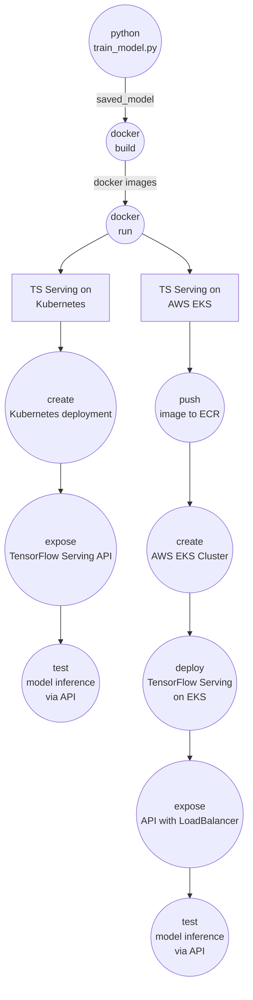
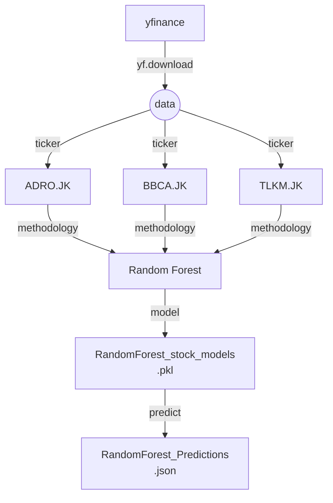
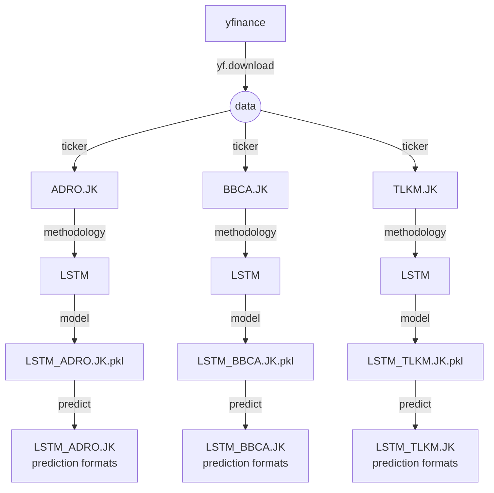

**Machine Learning - Zoomcamp**
# E-Commerce Engagement Prediction Model

---

## Project Overview

This project aims to predict the engagement of tweets related to several e-commerce companies. Engagement is defined as a combination of likes, replies, and retweets. The model processes input text (preprocessed tweets) and hashtag information to output an engagement score that reflects the potential audience interaction.

The project implements TensorFlow Serving, Kubernetes, Docker, and AWS Kubernetes (EKS) for efficient model deployment ⁷and scalability.

---

## Table of Contents

- Project Overview

- Features and Target

- Objective

- Technologies Used

- Dataset

- Tasks Flow

- Model
  
- Repositiry Structures

- Deployment Architecture

- How to Run the Project

- API Usage

- Results

- Future Improvements

- Acknowledgments

---

## Features and Target

### Features
1. clean_tweet: Preprocessed version of the tweet text (lowercased, tokenized, and cleaned).
2. hashtags: Count or presence of hashtags in the tweet

### Target
engagement: A continuous value representing the combination of likes, replies, and retweets.


## Objective

The primary goals of this project are to:

Predict the engagement score for a given tweet based on its content and hashtags.

Deploy the model using TensorFlow Serving for real-time predictions.

Containerize the application using Docker.

Orchestrate the deployment using Kubernetes and scale it on AWS EKS for production-level deployment.

---

## Technologies Used

The project integrates the following technologies:

1. HDFS: Saving data
2. Pyspark: Data processing
3. TensorFlow: For building and saving the deep learning model.
4. Flask: To create an API for serving predictions.
5. Docker: Containerizes the Flask API and TensorFlow model.
6. TensorFlow Serving: Optimized model serving for real-time predictions.
7. Kubernetes: Orchestrates containers for scaling and deployment.
8. AWS EKS: Managed Kubernetes service for deployment in the cloud.

--- 
## Dataset

Dataset header: **Indonesia's Top E-Commerce Tweets**

Dataset link: [https://www.kaggle.com/datasets/robertvici/indonesia-top-ecommerce-unicorn-tweets](https://www.kaggle.com/datasets/robertvici/indonesia-top-ecommerce-unicorn-tweets)

Dataset content: 


**About Dataset**

This dataset contains the tweets from the first tweet until April 2020 of top e-commerce unicorn in Indonesia namely Shopee, Tokopedia, Bukalapak, Lazada and Blibli.

The dataset consists of tweets about an associated engagement metrics. Each data point includes:
- Tweet text
- Number of hashtags
- Engagement value (target)

Preprocessing includes:
- Text cleaning: Removing punctuation, special characters, and links.
- Tokenization: Splitting text into tokens.

---

## Tasks Flow

Model deployment of TensorFlow Serving eith Kubernetes and AWS EKS.





### LSTM (Long Short-Term Memory)


## Model

The project uses a deep learning model built using Keras to predict the engagement score. The model is then exported for TensorFlow Serving.

Steps:
1. Train and save the model in TensorFlow SavedModel format.
2. Use TensorFlow Serving to serve the model.
3. Create a Flask API to send input to TensorFlow Serving and return predictions.

---

## Repository Structures

   ```
   ├── README.md                                 # Documentation for the project
   ├── build-docker-image.txt                    # Build docker and run container script 
   ├── deployment.yaml                           # Kubernetes deployment yaml script
   ├── deploy-on-kubernetes.txt                  # Script to create kubernetes deployment and services
   ├── Dockerfile                                # Instructions to containerize the application
   ├── engagement_model.keras                    # Keras model
   ├── predict_model.py                          # Model predict script 
   ├── saved_model                               # Final model saved
   │   ├── assets
   │   ├── fingerprint.pb
   │   ├── saved_model.pb
   │   └── variables
   │       ├── variables.data-00000-of-00001
   │       └── variables.index
   ├── service.yaml                             # Kubernetes services yaml script
   ├── TensorFlow Serving Deployment.ipynb      # Notebook -  Tensorflow Serving (notebook)
   ├── tokenizer.pkl                            # Tokenizer output
   ├── train_model.py                           # Model train script 
   └── train_model.ipynb                        # Model train script (notebook)
   ```

---

## Deployment Architecture

The project follows a microservices deployment architecture:

1. Model Deployment

   The trained Keras model is exported to TensorFlow SavedModel format.

   TensorFlow Serving hosts the model and provides an endpoint for predictions.

2. API Deployment

   A Flask application sends requests to TensorFlow Serving and returns predictions to clients.

   The Flask app is containerized using Docker.

3. Kubernetes Orchestration

   Both the TensorFlow Serving container and the Flask API container are orchestrated using Kubernetes.

   Kubernetes is deployed locally (minikube) or in AWS EKS for scalability.

4. AWS EKS Deployment

   Use AWS Elastic Kubernetes Service (EKS) for production-level deployment and scaling.

---

## How to Run the Project

### Prerequisites

Ensure you have the following installed:

- Python 3.10+
- Kaggle account and local authorization setup
- AWS account and local authorization & CLI setup
- TensorFlow/Keras
- Docker
- Kubernetes
- kubectl

### Steps

1. Model Training and Saving

   Run the model training script and save the model in TensorFlow SavedModel format:

   ```
   python train_model.py
   ```

2. Run TensorFlow Serving

   Build the Docker container with TensorFlow Serving:

   ```
   docker run -p 8501:8501 --name tf-serving-engagement \
     -v /path/to/saved_model:/models/engagement_model \
     -e MODEL_NAME=engagement_model \
     tensorflow/serving
   ```

3. Run Flask API

   Build and run the Flask API Docker container:

   ```
   docker build -t engagement-api .
   docker run -p 5000:5000 engagement-api
   ```

4. Deploy with Kubernetes

   Create deployment and service files:

   deployment.yaml

   ```
   apiVersion: apps/v1
   kind: Deployment
   metadata:
     name: engagement-api
   spec:
     replicas: 2
   selector:
      matchLabels:
        app: engagement-api
    template:
      metadata:
        labels:
          app: engagement-api
      spec:
        containers:
        - name: engagement-api
          image: your-flask-api-image:latest
          ports:
          - containerPort: 5000
   ```

   Deploy to Kubernetes:

   ```
   kubectl apply -f deployment.yaml
   kubectl apply -f service.yaml
   ```

5. AWS EKS Deployment

   - Configure AWS CLI and EKS:
     ```
     aws configure
     eksctl create cluster --name engagement-cluster --region your-region
     ```

   - Deploy containers to AWS:
     ```
     kubectl apply -f deployment.yaml
     kubectl apply -f service.yaml
     ```

---

## API Usage

- Endpoint

  POST /predict

- Input

  A JSON payload containing the following field:

  text: The tweet content.

  Example input:

  ```
  {
  "text": "Diskon besar Ramadan di Tokopedia!"
  }
  ```

- Output

  The API returns a prediction:

  ```
  {
  "prediction": [[256.78619384765625]]
  }
  ```


---

## Results

The model successfully predicts the engagement score for a tweet. For example:

Input: "Diskon besar Ramadan di Tokopedia!"
Output: 256.78

This score can be interpreted as the expected combination of likes, replies, and retweets.

---

## Future Improvements

1. Incorporate additional features such as posting time and user follower count.
2. Use Transformers for improved text understanding.
3. Integrate real-time tweet analysis pipelines with Kafka and Spark Streaming.
4. Optimize the EKS deployment for autoscaling and cost efficiency.

---

## Acknowledgments

Tools: HDFS, Pyspark, Numpy, TensorFlow Serving, Flask, Docker, Kubernetes, AWS EKS.

Data: [Indonesia's Top E-Commerce Tweets](https://www.kaggle.com/datasets/robertvici/indonesia-top-ecommerce-unicorn-tweets)

---
